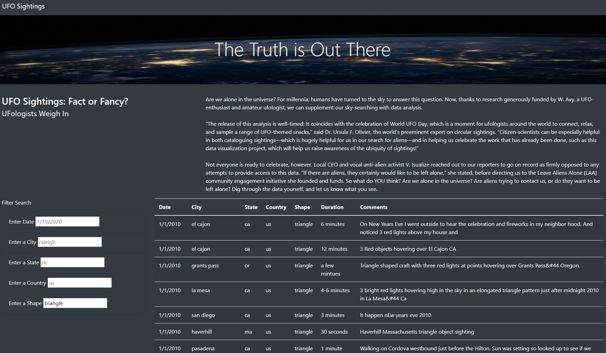
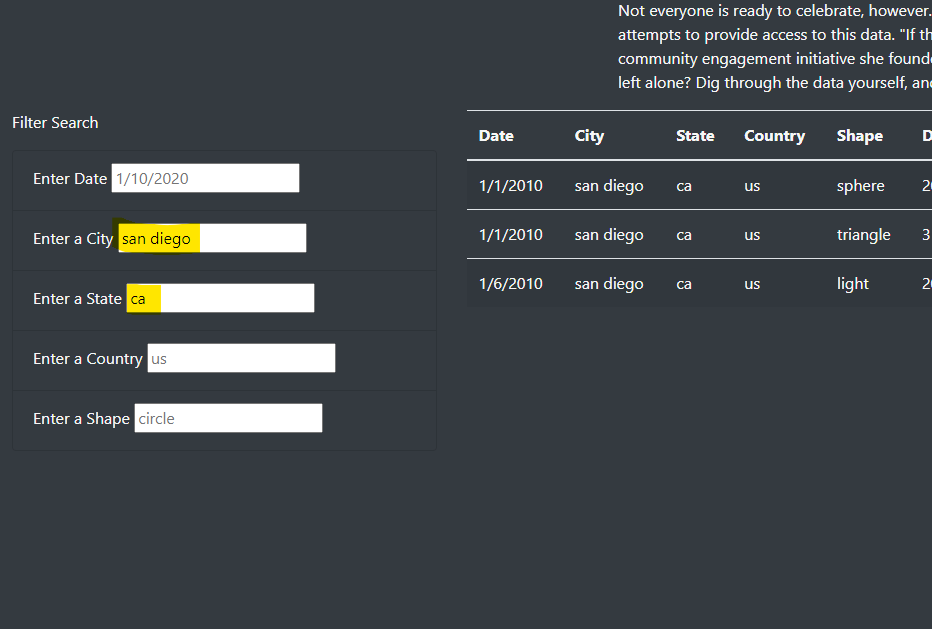
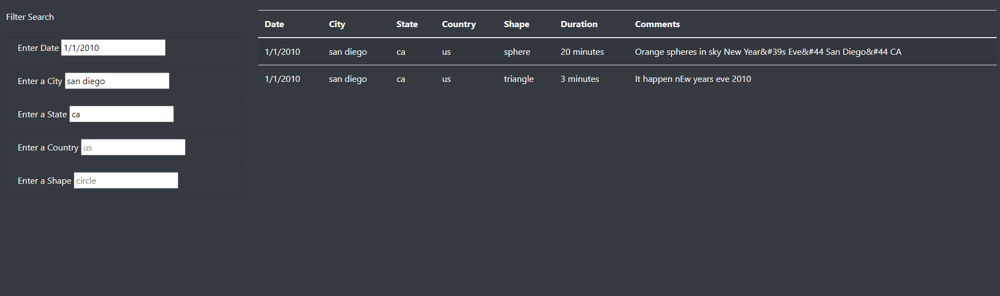

# UFO
Visualizing UFO sighting data with JavaScript, HTML, CSS and Bootstrap.

## Overview of Project

Using this dynamic webpage, the user can review a table of data from  UFO sightings in North America from 2010. Using the filters, the user can view data by date, location, and/or shape of the abnormal aeral phenomena. 

## Results
<!-- Describe to Dana how someone might use the new webpage by walking her through the process of using the search criteria. use images of your webpage during the filtering process to support your explanation. -->

To use the webpage, enter values in the filter form to the left of the table. Once you fill in a filter and hit Enter, you will see the table update with data that matches your selection. Continue adding filters of Date, City, State, Country, or Shape to view 

Follow the light gray example text in the white form boxes to see the proper syntax for searching the data. For example: 

1. next to "Enter a City," enter "san diego" in all lowercase letters into the white box. 
2. next to "Enter a State," enter "ca" in all lowercase letters.

Viewing the data that appears in the table, you see that two of them are on New Year's Eve. Were Aliens curious about, or jealous even, of the fireworks display in San Diego on New Year's Even in 2010? 

3. Filter the data further by typing 1/1/2010 into the date field along with the other two filters. 

The results show 2 sightings occurred on New Year's Eve 2010 in San Diego, CA. However, looking at the shape column, it appears these were likley not the same object as one was a spherical shape and the other was a triangle. 

#### Pro Tip: open the devtools console (right click > inspect) to see a list of the filters passed into the resulting table.

## Summary

Using the D3 library within JavaScript allowed us to easily organize data in an HTML table, request user input via a filter form, and dynamically update the table with the filtered data. 

### Drawbacks

Besides the limited number of datapoints in the dataset, most of the data has the same country, and a date in January 2010, so there are not many reasons to use more than 1 or 2 filters.Once you use one filter, much of the data is filtered out, so there is not much need to continue using the form. 

### Further analysis

1.  With more data spanning several years, you coud change the data filter to be a date range filter, allowing the user to set a range of a week or year to analyze the data over longer date ranges and look for trends. 

2.  For readability, it would be better to clean the "Comments" column data to remove unnecessary special characters.
